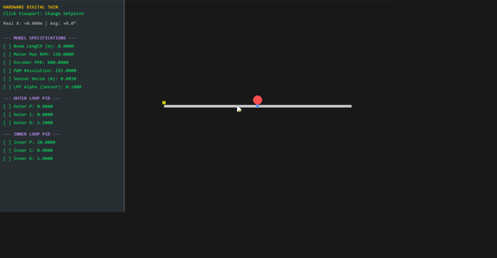

# <h1 align="center">🎛️ Ball and Beam: Hardware-Accurate Digital Twin</h1>

  
  
  

> **Ball and Beam Digital Twin** is a hardware-informed simulation platform built to close the gap between control theory and embedded deployment.  
> It enables firmware validation in a virtual environment that faithfully reproduces real-world mechanical and electronic constraints before moving to physical hardware.

---

## 📐 Nonlinear Physical Modeling

The system simulates a solid steel ball rolling on a beam controlled by angular actuation. The model incorporates nonlinear dynamics and real mechanical effects to ensure realistic behavior:

- **Rolling Dynamics Compensation**  
  Rotational inertia of a solid sphere is included using the rolling factor  
  B = 5/7  
  ensuring accurate acceleration response.

- **Gravity & Friction Effects**  
  Gravitational acceleration, rolling resistance, and friction forces are modeled to replicate real motion characteristics.

- **Signal Conditioning**  
  An **EMA (Exponential Moving Average)** low-pass filter smooths derivative terms and reduces simulated measurement noise.

---

## 🛠️ Hardware Abstraction Layer (HAL) Simulation

Rather than assuming ideal components, this Digital Twin embeds realistic hardware constraints to stress-test control firmware prior to deployment.

| Subsystem | Simulated Constraint |
|-----------|---------------------|
| **Distance Sensor** | Gaussian noise injection and millimeter-level quantization to emulate real sensor resolution |
| **Angle Encoder** | Discrete angle measurement based on configured **PPR (Pulses Per Revolution)** |
| **Actuator & Motor Drive** | PWM resolution limits (e.g., 8-bit / 255 levels) and motor RPM saturation |

This approach ensures firmware robustness under non-ideal operating conditions.

---

## 🎮 Control Architecture: Dual-Loop Cascaded PID

To stabilize the under-actuated ball-and-beam system, a **Cascaded PID** structure is implemented:

1. **Outer Loop – Position Control**  
   Computes the required beam angle from the ball position error.

2. **Inner Loop – Angle Control**  
   Drives the motor actuator to reach the target beam angle.

3. **Protection & Stability Features**
   - Integrator Anti-Windup  
   - Output Clamping  
   - Saturation-aware control logic  

These mechanisms prevent instability during large setpoint transitions or actuator saturation.

---

## 🚀 Purpose

This project supports:

- Control algorithm validation  
- Firmware-in-the-loop testing  
- V-model development workflows  
- Risk reduction before hardware commissioning  

---

## 📄 License

This project is licensed under the MIT License — see the [LICENSE](./LICENSE) file for details.

---
